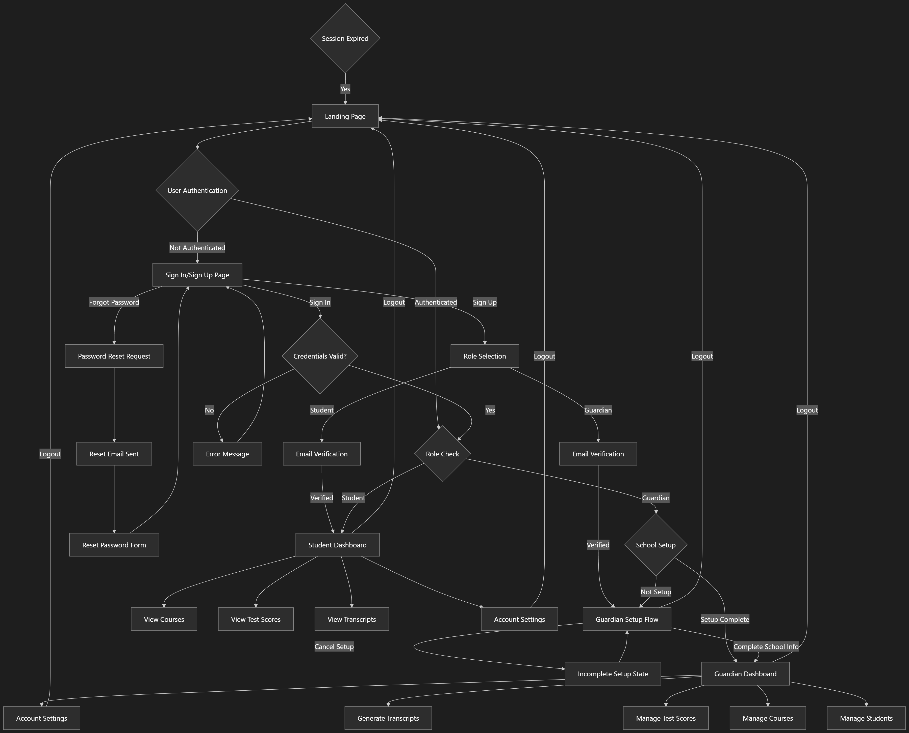

# HomeSchoolTracker



A modern, full-featured platform for managing homeschooling activities, courses, students, and subscriptions. HomeSchoolTracker provides dashboards for guardians and students, robust course and test management, and seamless subscription handling with PayPal integration.

---

## Key Features
- Guardian and student dashboards
- Course and test score management
- Subscription management with PayPal integration
- Supabase backend for authentication, data, and edge functions
- Admin tools for user and subscription oversight
- Modern UI with React, Vite, and Tailwind CSS
- Comprehensive documentation and test plans

---

## Project Structure
- `src/` – Main frontend application (components, hooks, lib)
- `supabase/` – Supabase edge functions, migrations, and configuration
- `docs/` – Project documentation, diagrams, and test plans
  - `docs/assets/` – Images and diagrams (e.g., user flow)
  - `docs/testing/` – Test plans, bug reports, QA docs
- `test-results/` – Playwright and integration test results
- `tests/` – Edge function and backend tests

---

## Getting Started

### Prerequisites
- Node.js (v18+ recommended)
- npm
- Supabase account and CLI
- PayPal developer account (for sandbox/production keys)
- Netlify account (for deployment, optional)

### Setup
1. **Clone the repository:**
   ```sh
   git clone <repo-url>
   cd HomeSchoolTracker
   ```
2. **Install dependencies:**
   ```sh
   npm install
   ```
3. **Configure environment variables:**
   - Copy `.env.example` to `.env` and fill in Supabase, PayPal, and other required keys.
   - See `docs/` for details on required variables.
4. **Supabase setup:**
   - Run Supabase migrations:
     ```sh
     supabase db migrate up
     ```
   - Deploy edge functions as needed.
5. **Run the development server:**
   ```sh
   npm run dev
   ```
6. **Netlify deployment:**
   - Configure build settings and environment variables in Netlify dashboard.
   - See `netlify.toml` for build configuration.

---

## Testing
- **Unit/Integration tests:**
  ```sh
  npm test
  ```
- **Playwright end-to-end tests:**
  ```sh
  npx playwright test
  ```
- Test results and reports are in `test-results/`.
- See `docs/testing/` for test plans and bug reports.

---

## Documentation
- All documentation, diagrams, and test plans are in the `docs/` directory.
- See `docs/user_flow.md` for a detailed user flow and diagram.
- For PayPal and Supabase integration details, see:
  - `docs/paypal_integration_completion_prd.md`
  - `docs/DATABASE_MIGRATION_INSTRUCTIONS.md`
  - `docs/PayPal_Plan_IDs_Mapping.md`

---

## Contributing
Pull requests and issues are welcome! Please see the documentation in `docs/` and follow clean code and commit guidelines.

---

## License

This project is licensed under the MIT License. See the [LICENSE](./LICENSE) file for details.